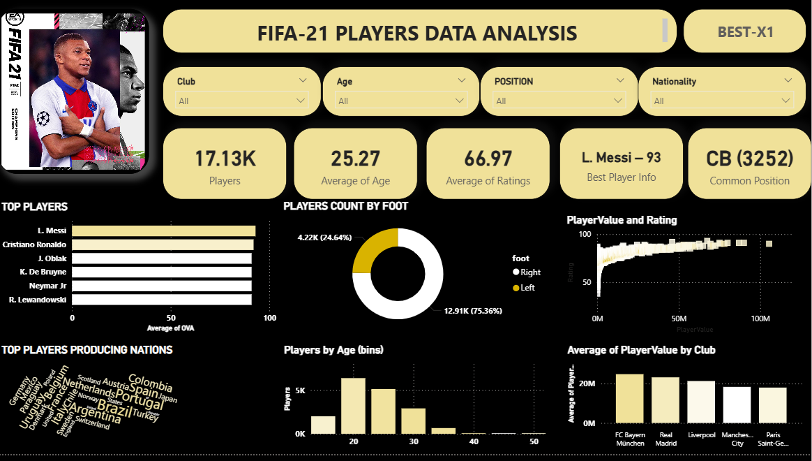
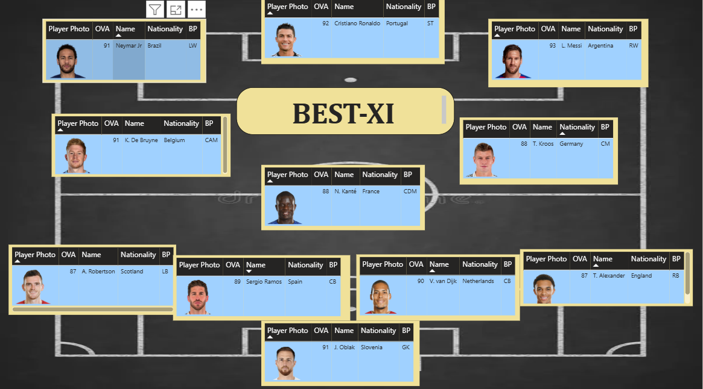

## ⚽ Best XI - Football Players Dashboard in Power BI

### 📌 Project Overview

This interactive dashboard presents the **Best Starting XI** of football players using Power BI. The data-driven visuals allow users to explore top-performing players, stats, and team composition in a realistic football field layout. It blends data analytics with intuitive storytelling to showcase top talent in an engaging format.

---

### 🔍 Features

- ✅ **Custom Formation Layout** (4-3-3) on a Football Pitch
- ✅ **Interactive Player Cards** (Name, Nationality, Rating)
- ✅ **Dynamic Filtering** based on Nation, Club, or Position
- ✅ **Clean UI** with visual hierarchy for easy navigation
- ✅ **Power BI Visualization & UX Skills Highlighted**

---

### 📁 Dataset Information

- **Source**: FIFA/Football player dataset (cleaned and modified)
- **Fields Used**:  
  `Name`, `Nationality`, `Overall Rating (OVA)`, `Position`, `Image URL`, `Club`, `Jersey Number`, etc.

---

### 🛠️ Tools & Tech

- **Power BI Desktop**
- DAX (Calculated Columns)
- Custom Visuals (Image by URL, Cards)
- Pitch Formation using Shape Layering

---

### 🎯 Purpose

To demonstrate:
- How to convert structured data into visual storytelling  
- Skills in data visualization, UX, and interactivity  
- Real-world application of Power BI in sports analytics

---

### 📸 Screenshots

---

### 📦 How to Use

1. Clone or download this repo
2. Open the `.pbix` file in Power BI Desktop
3. Explore filters, interactivity, and formation-based visuals

---

### 📤 Export Options

- You can export this dashboard as:
  - **PDF (Static)**
  - **.pbix file** for interactive use
  - Embed into **Power BI Service** for web-based sharing (recommended)

---

### 💡 Future Improvements

- Add multiple formation options (e.g. 4-4-2, 3-5-2)
- Include player stats like goals, assists, market value
- Deploy on Power BI Web or as an embedded app

---

### 👤 Author

**Zahid Mohammed**  
[GitHub](https://github.com/zahid16-code) | [LinkedIn](https://www.linkedin.com/in/zahid16-code)  
Open to opportunities in Data Analytics, Sports Analytics, and BI Development
